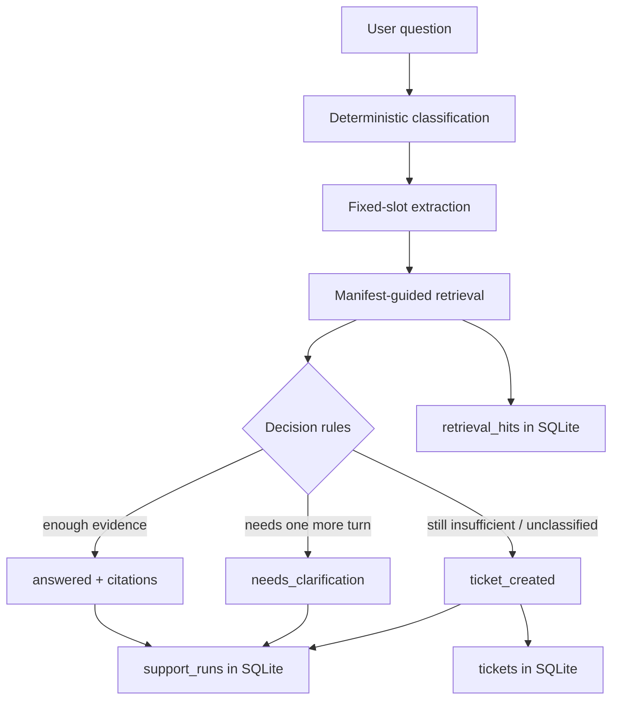

# Dify Internal Support Copilot

Deterministic support triage MVP for self-hosted Dify operations: classify a support question, retrieve grounded evidence from official Dify docs, either answer conservatively, ask one clarification, or create a ticket.

## Why This Project Exists

Most Dify support demos stop at "chat over docs". That misses the real internal support workflow:

- questions are not always answerable on first turn
- vague problem reports should not be answered too confidently
- support needs escalation paths, retrieval logs, and replayable evaluation
- self-hosted support depends on a bounded, authoritative corpus rather than open-ended web search

This repo focuses on that narrower but more defensible slice:

- single product corpus: Dify official English docs
- single support chain: classify -> retrieve -> answer / clarify / ticket
- deterministic baseline instead of remote LLM dependency
- replay eval to measure behavior changes before changing rules

## Current Capabilities

The current implementation supports:

- `GET /healthz`
- `POST /v1/support/ask`
- `GET /v1/runs/{run_id}`
- `GET /v1/tickets/{ticket_id}`
- deterministic classification into:
  - `deployment`
  - `configuration`
  - `knowledge-base`
  - `integration`
  - `unclassified`
- fixed slot extraction for:
  - `deployment_method`
  - `version`
  - `error_message`
  - `environment`
- manifest-guided retrieval over locally indexed Dify documentation
- three synchronous support outcomes:
  - `answered`
  - `needs_clarification`
  - `ticket_created`
- one-turn clarification limit via `follow_up_run_id`
- retrieval hit logging and SQLite ticket persistence
- replay eval cases with threshold verification for the current baseline

## What This Is Not

This repository is intentionally not:

- a remote-LLM support system
- a generic agent framework
- a multi-agent orchestration demo
- a production-grade support platform
- a dashboard or frontend product
- a multi-source knowledge platform
- a vector database benchmark

Current answer generation is retrieval-backed extractive assembly. Current classification is deterministic. Clarification text is rule-generated. No external model provider is called.

## Architecture Overview



Key data flow:

- source manifest lives in [`data/sources.yaml`](/D:/AI%20agent/dify-support-copilot/data/sources.yaml)
- raw and cleaned documentation snapshots are fetched locally
- cleaned text is chunked and indexed into SQLite FTS5
- `/v1/support/ask` reuses that local retrieval layer
- replay eval replays version-controlled support cases against the same chain

More detail:

- architecture notes: [docs/ARCHITECTURE.md](/D:/AI%20agent/dify-support-copilot/docs/ARCHITECTURE.md)
- demo script: [docs/DEMO_SCRIPT.md](/D:/AI%20agent/dify-support-copilot/docs/DEMO_SCRIPT.md)
- interview notes: [docs/INTERVIEW_NOTES.md](/D:/AI%20agent/dify-support-copilot/docs/INTERVIEW_NOTES.md)
- resume bullets: [docs/RESUME_BULLETS.md](/D:/AI%20agent/dify-support-copilot/docs/RESUME_BULLETS.md)

## Tech Stack

- Python
- FastAPI
- Pydantic
- SQLite
- SQLite FTS5 for local lexical retrieval
- pytest
- PowerShell-friendly CLI scripts
- Docker / Docker Compose for local packaging

The public-facing wording stays intentionally generic: retrieval is a `lightweight local vector store` step in product framing, while the current Day 3/4 implementation uses SQLite FTS5 as the simplest local retrieval backend.

## Corpus Boundary

Authority boundary:

- single corpus domain: Dify
- official English docs only
- primary authority: `docs.dify.ai`
- no forum/blog/issues backfilled into the knowledge base

Snapshot boundary:

- `snapshot_version` is currently a manifest/batch label, not a full immutable history system
- Day 5 hardening prevents silent content drift inside the same `snapshot_version`
- `requested_url` and `final_url` are stored separately to avoid redirect ambiguity

## Local Run

### 1. Install dependencies

```powershell
cd D:\AI agent\dify-support-copilot
.\.venv\Scripts\python -m pip install -r requirements.txt
```

### 2. Fetch docs and build the local index

```powershell
.\.venv\Scripts\python scripts\fetch_sources.py
.\.venv\Scripts\python scripts\build_index.py
```

### 3. Start the API

```powershell
.\.venv\Scripts\python -m uvicorn app.api.main:app --host 127.0.0.1 --port 8000
```

## Minimal Demo Flow

### Health check

```powershell
Invoke-RestMethod -Method Get -Uri 'http://127.0.0.1:8000/healthz'
```

Expected shape:

```json
{
  "status": "ok",
  "service": "dify-support-copilot",
  "app_env": "dev",
  "sqlite_ready": true
}
```

### Answered example

```powershell
$answered = Invoke-RestMethod -Method Post -Uri 'http://127.0.0.1:8000/v1/support/ask' -ContentType 'application/json' -Body '{
  "question": "How do I configure chunk settings for a knowledge base in Dify?"
}'
$answered | ConvertTo-Json -Depth 6
```

Expected behavior:

- `run.status = "answered"`
- `answer` is non-empty
- `citations` is non-empty

### Clarification example

```powershell
$clarify = Invoke-RestMethod -Method Post -Uri 'http://127.0.0.1:8000/v1/support/ask' -ContentType 'application/json' -Body '{
  "question": "My plugin integration fails."
}'
$clarify | ConvertTo-Json -Depth 6
```

Expected behavior:

- `run.status = "needs_clarification"`
- `clarification.question` is non-empty
- `clarification.missing_slots` is non-empty

### Follow-up to ticket example

```powershell
$followUpBody = @{
  question = "Still failing after I retried the integration."
  follow_up_run_id = $clarify.run.run_id
} | ConvertTo-Json

$ticket = Invoke-RestMethod -Method Post -Uri 'http://127.0.0.1:8000/v1/support/ask' -ContentType 'application/json' -Body $followUpBody
$ticket | ConvertTo-Json -Depth 6
```

Expected behavior:

- `run.status = "ticket_created"`
- `ticket.ticket_id` is present

Full step-by-step version:

- [docs/DEMO_SCRIPT.md](/D:/AI%20agent/dify-support-copilot/docs/DEMO_SCRIPT.md)

## Replay Eval Summary

Current local replay baseline uses version-controlled support cases in [`data/evals/support_eval_v1.yaml`](/D:/AI%20agent/dify-support-copilot/data/evals/support_eval_v1.yaml).

Coverage:

- 4 categories: deployment / configuration / knowledge-base / integration
- 3 outcomes: answered / needs_clarification / ticket_created
- includes two-turn escalation cases

Current baseline summary:

- `status_accuracy = 1.00`
- `category_accuracy = 1.00`
- `answered_citation_hit_rate = 1.00`
- `clarification_slot_match_rate = 1.00`
- `ticket_path_pass_rate = 1.00`

Run locally:

```powershell
.\.venv\Scripts\python scripts\run_eval.py
```

This is a local replay eval baseline, not an online experimentation platform.

## Known Limitations

- no remote LLM provider is integrated
- answer style is conservative and extractive, not conversational synthesis
- only one product corpus is supported
- retrieval is lexical local retrieval, not embedding-based semantic search
- clarification logic is rule-based and intentionally narrow
- one clarification turn only
- `snapshot_version` is not a full immutable version-management system
- no frontend, queue, auth layer, or dashboard

## Repository Map

- API entry: [app/api/main.py](/D:/AI%20agent/dify-support-copilot/app/api/main.py)
- support decision chain: [app/support/service.py](/D:/AI%20agent/dify-support-copilot/app/support/service.py)
- retrieval index/search: [app/retrieval/index.py](/D:/AI%20agent/dify-support-copilot/app/retrieval/index.py)
- eval runner: [scripts/run_eval.py](/D:/AI%20agent/dify-support-copilot/scripts/run_eval.py)
- architecture notes: [docs/ARCHITECTURE.md](/D:/AI%20agent/dify-support-copilot/docs/ARCHITECTURE.md)

## Development Notes

This repository was built incrementally across Day 1-7 milestones, but the README no longer mirrors that day-by-day build log. Historical staging can be inferred from commit history; the current docs focus on the project as it exists now.
