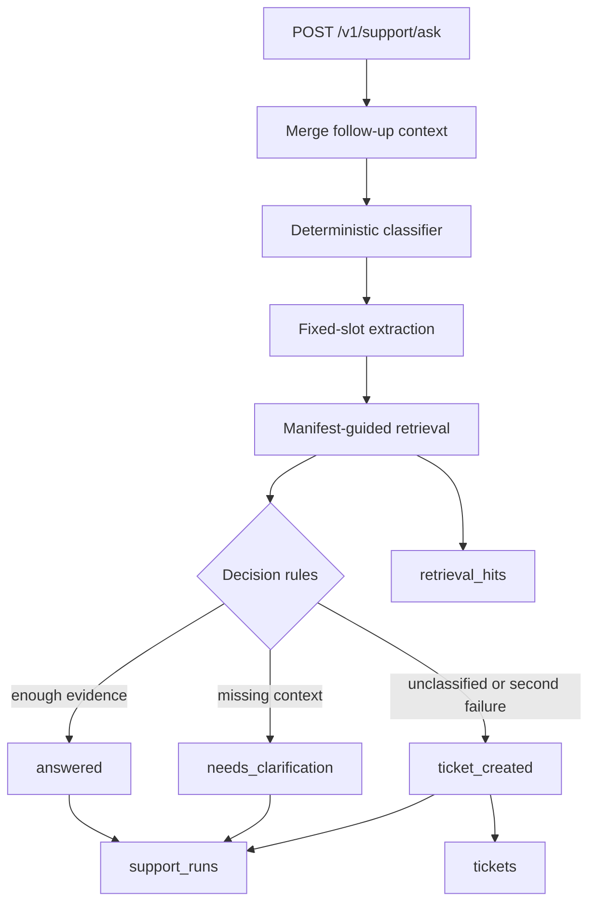

# Architecture Notes

## System Shape

This project is a bounded internal support triage system for self-hosted Dify operations. It is deliberately narrower than a generic RAG chatbot.

Core chain:

1. receive a support question
2. classify it into one of four business categories or `unclassified`
3. extract a fixed, small set of diagnostic slots
4. retrieve evidence from a single local Dify corpus
5. decide between:
   - `answered`
   - `needs_clarification`
   - `ticket_created`
6. persist run, retrieval, and ticket artifacts in SQLite

## Module Map

- [`app/api/main.py`](/D:/AI%20agent/dify-support-copilot/app/api/main.py)
  FastAPI entrypoint and route registration.

- [`app/api/routes/support.py`](/D:/AI%20agent/dify-support-copilot/app/api/routes/support.py)
  Exposes `POST /v1/support/ask`.

- [`app/support/service.py`](/D:/AI%20agent/dify-support-copilot/app/support/service.py)
  Main Day 4-7 decision chain:
  classification, slot extraction, retrieval dispatch, clarification/ticket rules, response assembly.

- [`app/ingest/`](/D:/AI%20agent/dify-support-copilot/app/ingest)
  Day 2 and Day 5 ingestion logic: manifest loading, fetching, cleaning, snapshot metadata persistence, drift protection.

- [`app/retrieval/`](/D:/AI%20agent/dify-support-copilot/app/retrieval)
  Day 3 chunking and local retrieval.

- [`app/eval/`](/D:/AI%20agent/dify-support-copilot/app/eval)
  Day 6 replay evaluation.

- [`app/models/db.py`](/D:/AI%20agent/dify-support-copilot/app/models/db.py)
  SQLite persistence helpers.

## Main Runtime Flow

## Why Deterministic Baseline First

The project intentionally did not start with an external LLM integration.

Reasons:

- no dependency on model credentials for local execution
- lower variance during early engineering loops
- easier replay evaluation
- clearer product boundary for interview discussion
- easier to prove which part of the chain is actually implemented

This choice trades answer flexibility for inspectability. That is acceptable at this stage because the main engineering question was whether the support workflow itself could be made concrete and testable.

## Why Only One Dify Corpus

The repo uses a single authoritative corpus on purpose.

Reasons:

- support answers should be grounded in official docs
- adding forums, blogs, or issue threads would increase retrieval noise
- a narrow corpus makes replay eval and retrieval debugging interpretable
- it avoids pretending that broad coverage equals support quality

This is why `docs.dify.ai` English pages remain the authority boundary.

## Why `requested_url` and `final_url` Are Separate

Day 5 hardened snapshot semantics because a single URL field was too ambiguous.

Separating them matters because:

- the manifest may request one URL
- the server may redirect to another
- later debugging needs to distinguish the requested source from the final stored page

This supports a clearer snapshot record without turning the project into a full document version-management system.

## Why Replay Eval Came Before More Features

Day 6 added replay eval before any LLM work or broader product expansion.

Reason:

- the main risk was silent behavior drift in support decisions
- without replay, rule changes are hard to justify
- replay made false-answered cases visible
- Day 7 then fixed the exact false-answered pattern exposed by eval

That sequence is more defensible than adding more "AI" surface area without a measurement loop.

## Known Deliberate Constraints

- no external LLM provider
- no embeddings API
- no multi-vector-store abstraction
- no async worker or queue
- no dashboard or frontend
- no memory or long-running conversation state
- no multi-agent orchestration

These omissions are deliberate scope control, not missing polish.
